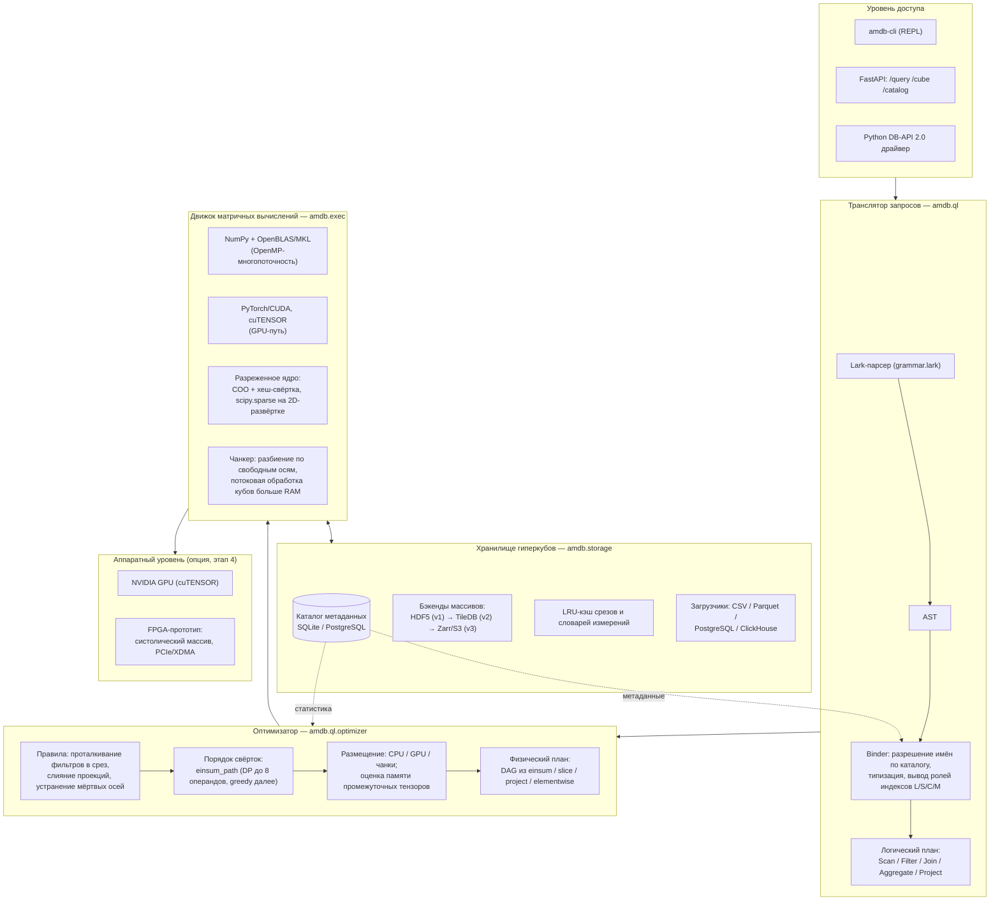
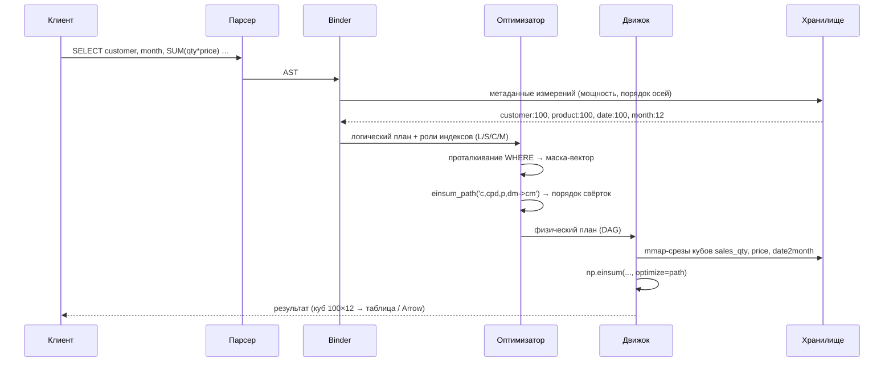
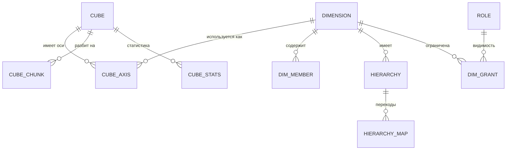
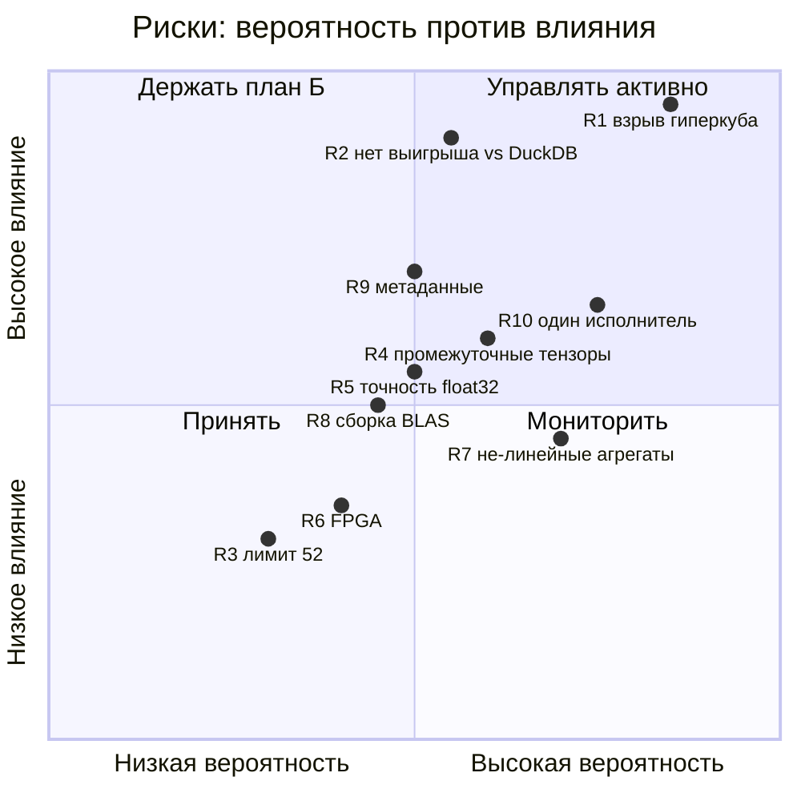
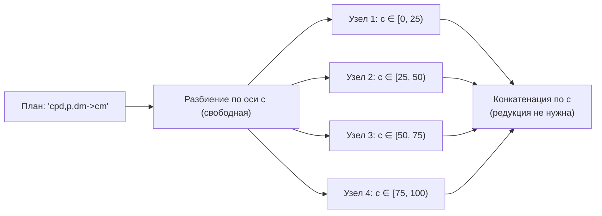

# ПАК «Алгебраическая машина баз данных» (AMDB)

**Технический проект: архитектура, план реализации, критерии приёмки**

Версия документа: 1.0 · Дата: 2026‑08‑25
Основание: ТЗ на разработку ПАК; статья Симакова В.А. «Применение соглашения Эйнштейна для эффективной реализации (λ, μ)-свёрнутого произведения многомерных матриц» (файл `Статья Симаков.docx` в корне репозитория).

---

## 0. Резюме и ключевые инженерные решения

| Вопрос | Решение | Обоснование |
|---|---|---|
| Язык ядра | **Python 3.11+**, критические ядра — C++17/pybind11 **только после профилирования** | Вся тяжёлая арифметика уходит в BLAS/cuTENSOR; переписывать обвязку на C++ смысла нет |
| Операция свёртки | `np.einsum(..., optimize=True)` / `torch.einsum` | Подтверждено экспериментом статьи: до 82× быстрее наивной реализации на Go |
| Модель хранения | **Не один глобальный гиперкуб, а набор кубов фактов + разделяемые измерения** («звезда» в матричном виде) | Единый куб по всем сущностям взрывается комбинаторно (риск R1) |
| Плотность | Гибрид: плотные блоки (`float32`) + COO для разреженных фактов, автовыбор по фактору заполнения | Реальные OLAP-факты имеют заполненность 10⁻³…10⁻⁶ |
| Оптимизатор | `einsum_path` (DP/жадный) + собственные правила проталкивания фильтров | Порядок свёрток меняет число операций на порядки |
| Целевой класс задач | Плотные/полуплотные агрегаты по осям малой мощности (≤ 10⁷ ячеек), звёздные соединения | Именно здесь матричная модель реально выигрывает у строкового исполнения |

**Результаты, измеренные на этой машине (Python 3.12, NumPy 2.1.1, MSVC-сборка):**

* эталонная (2,3)-свёртка ранг 6 × ранг 9 совпадает с прямым вычислением — max err 8.9e‑16;
* `(1,1)`-свёртка 100×100×100 — **61.7 мс** (согласуется с 65 мс из таблицы 1 статьи);
* типовой OLAP-запрос (`GROUP BY` по 2 измерениям, свёртка по 2 осям, куб 100×100×100) — **0.4–0.8 мс** (с фильтром и без — в пределах разброса). Требование ТЗ «< 1 с» перекрыто более чем в 1000 раз;
* загрузка 500 000 строк факта в гиперкуб 100×100×100 — **31 мс**.

Скрипты воспроизведения — каталог `proto/` (см. §4.6).

---

## 1. Математическое ядро: формализация и её отображение в einsum

### 1.1 Определение (Соколов)

Для многомерных матриц `A` ранга `k + λ + μ` и `B` ранга `λ + μ + v`:

```
c[l1…lk, s1…sλ, m1…mv] = Σ по (c1…cμ)  a[l1…lk, s1…sλ, c1…cμ] · b[s1…sλ, c1…cμ, m1…mv]
```

Четыре роли индексов:

| Роль | Обозначение | Поведение | OLAP-смысл |
|---|---|---|---|
| Свободные левого операнда | `l1…lk` | остаются | измерения, уникальные для факта A |
| Разделяемые (λ) | `s1…sλ` | общие для A и B, **не суммируются** | ключ соединения, остающийся в `GROUP BY` |
| Свёртываемые (μ) | `c1…cμ` | общие, **суммируются** | ключ соединения, «схлопываемый» агрегатом |
| Свободные правого операнда | `m1…mv` | остаются | измерения, уникальные для факта B |

Ключевое наблюдение, на котором строится весь транслятор: **λ-индексы — это в точности семантика `JOIN` с сохранением ключа в `GROUP BY`, а μ-индексы — семантика `JOIN` с последующей агрегацией по ключу соединения.** Это и есть практический мостик между реляционной и многомерно-матричной моделями, о котором пишет Мунерман.

### 1.2 Отображение в einsum

Раскладка осей канонизируется как `A: [L | S | C]`, `B: [S | C | M]`, результат `C: [L | S | M]`, после чего einsum-строка строится механически. Пример из статьи (ранг A = 6, ранг B = 9, (2,3)-свёртка) воспроизводится точно:

```
abcdef,bcdefghij->abcghij
```

(в статье те же индексы названы `abcdef, bcdefghlj -> abcghlj`; различие только в именовании букв).

### 1.3 Уточнение к статье: предел числа индексов

В статье указано ограничение в **26** различных индексов. Фактически:

* NumPy принимает `a–z` **и** `A–Z` → **52** индекса (проверено: `np.einsum('aB,Bc->ac', A, B)` работает);
* «списочная» форма `np.einsum(A, [0,1], B, [1,2], [0,2])` **лимит не снимает**: при индексе ≥ 52 выдаётся `ValueError: subscript is not within the valid range [0, 52)`;
* следовательно, при суммарном числе различных индексов > 52 нужна **декомпозиция цепочки на несколько последовательных einsum-вызовов** (это делает планировщик, §4.4) либо блочное представление данных.

Практический потолок — 52 различных измерения на одну элементарную операцию; на план в целом ограничения нет. Рекомендую внести это уточнение в статью: тезис «легко обходится блочным представлением» стоит дополнить более дешёвым приёмом — разбиением на цепочку парных свёрток.

---

## 2. Архитектура ПАК

### 2.1 Слоевая диаграмма



### 2.2 Поток выполнения запроса



### 2.3 Структура репозитория

```
amdb/
├── amdb/
│   ├── core/                 # Этап 1: математическое ядро
│   │   ├── mdm.py            #   MultidimensionalMatrix (именованные оси)
│   │   ├── convolve.py       #   build_einsum, convolve
│   │   ├── ops.py            #   slice, project, transpose, elementwise
│   │   └── sparse.py         #   COO-гиперкуб, гибридные свёртки
│   ├── storage/              # Этап 2
│   │   ├── catalog.py        #   метаданные (SQLAlchemy)
│   │   ├── dimension.py      #   словари измерений, кодирование
│   │   ├── loader.py         #   CSV/Parquet/PostgreSQL/ClickHouse → куб
│   │   ├── backend_hdf5.py   #   v1
│   │   └── backend_tiledb.py #   v2
│   ├── ql/                   # Этап 3
│   │   ├── grammar.lark, ast.py, binder.py, planner.py, optimizer.py
│   ├── exec/
│   │   ├── engine_numpy.py, engine_torch.py, chunker.py, mpi_runner.py
│   ├── security/             # RLS по измерениям
│   └── api/                  # FastAPI + CLI
├── bench/                    # воспроизводимые бенчмарки + baseline DuckDB/ClickHouse
├── tests/
├── docs/                     # Sphinx
└── proto/                    # исполняемые прототипы из настоящего документа
```

---

## 3. План реализации по этапам

Оценки — в **человеко-неделях (чел.-нед.)** при полной занятости одного инженера уровня «аспирант + опыт Python/NumPy». Указан также критический путь: этапы 1→2→3 последовательны, 4 и 5 параллелятся после этапа 3.

### Этап 0. Инфраструктура проекта — 1 чел.-нед.

| Задача | Оценка |
|---|---|
| Репозиторий GitHub, лицензия Apache 2.0, `pyproject.toml`, `ruff`+`mypy` | 0.3 |
| CI-матрица GitHub Actions: Windows / Linux / macOS × Python 3.11–3.13 | 0.4 |
| Каркас Sphinx, шаблон ADR (архитектурных решений) | 0.3 |

### Этап 1. Математическое ядро — 5 чел.-нед.

| Задача | Оценка | Выход |
|---|---|---|
| `MultidimensionalMatrix`: именованные оси, метаданные, `__array__` | 1.0 | `core/mdm.py` |
| `build_einsum` + `convolve(A, B, λ, μ)`, канонизация раскладки осей | 0.8 | `core/convolve.py` |
| Срез, проекция, транспонирование, поэлементные операции | 0.7 | `core/ops.py` |
| Разреженный COO-гиперкуб + гибридная свёртка (COO×dense, COO×COO через хеш-соединение) | 1.5 | `core/sparse.py` |
| Property-based тесты (Hypothesis) против наивной реализации; ассоциативность, коммутативность по μ | 0.7 | `tests/test_core.py` |
| Бенчмарк-набор, повторяющий таблицу 1 статьи | 0.3 | `bench/bench_convolve.py` |

**DoD:** покрытие ≥ 90 %, все свёртки совпадают с эталоном до 1e‑12 (float64), время `(1,1)` 100³ ≤ 100 мс.

### Этап 2. Хранилище гиперкуба — 6 чел.-нед.

| Задача | Оценка |
|---|---|
| Схема каталога метаданных + миграции (Alembic) | 1.0 |
| `Dimension`: словари, кодирование/декодирование, иерархии (date→month→year как разреженные матрицы переходов) | 1.2 |
| Загрузчик CSV/Parquet → куб (векторизованный `ravel_multi_index` + `bincount`) | 0.8 |
| Загрузчики PostgreSQL / ClickHouse (потоковый курсор, чанки) | 1.0 |
| Бэкенд HDF5: чанкованное хранение, сжатие, `mmap`-срезы | 1.0 |
| LRU-кэш срезов + инвалидация при дозагрузке | 0.5 |
| Инкрементальная дозагрузка (append по оси времени) | 0.5 |

**DoD:** куб 10⁷ ячеек грузится из PostgreSQL и переживает round-trip на диск без потери точности; произвольный срез читается за O(размер среза), а не O(куб).

### Этап 3. Транслятор запросов — 8 чел.-нед.

| Задача | Оценка |
|---|---|
| Грамматика Lark: `SELECT/FROM/JOIN/WHERE/GROUP BY/HAVING/ORDER BY/LIMIT` | 1.0 |
| AST + Binder (разрешение имён, вывод ролей L/S/C/M, проверка типов) | 1.5 |
| Планировщик: логический план → DAG einsum-операций | 2.0 |
| Оптимизатор: проталкивание фильтров, `einsum_path`, оценка памяти, разбиение при > 52 индексов | 2.0 |
| Агрегаты `SUM/COUNT/AVG/MIN/MAX` (в т.ч. не-линейные — через отдельные ядра, см. §6.4) | 1.0 |
| Вложенные запросы и оконные функции | 0.5 (базово; полная поддержка — отдельная веха) |

**DoD:** 20 эталонных запросов (набор `tests/queries/`) транслируются и дают результат, побитово совпадающий с DuckDB на тех же данных.

### Этап 4. Ускорение (GPU обязательно, FPGA — опция) — 4 + 10 чел.-нед.

| Задача | Оценка |
|---|---|
| Бэкенд PyTorch/CUDA, единый интерфейс `Engine`, автоперенос данных | 2.0 |
| Интеграция cuTENSOR для крупных свёрток, замер против cuBLAS | 1.0 |
| Чанкер для кубов больше видеопамяти | 1.0 |
| *(опция)* FPGA: систолический массив 16×16, HLS/Verilog, XDMA-драйвер, host API | 10.0 |

**Рекомендация:** FPGA-ветку не начинать до подтверждения на GPU, что операция упирается в вычисления, а не в память. Для типовых OLAP-свёрток арифметическая интенсивность низкая — узкое место обычно память, и FPGA даст менее 2× при трудозатратах в 10 чел.-нед. Обоснованный вариант — вместо FPGA вложиться в разреженные ядра.

### Этап 5. Интеграция и внешний контур — 5 чел.-нед.

| Задача | Оценка |
|---|---|
| REST API (FastAPI) + CLI | 1.0 |
| Разграничение доступа по измерениям (RLS, §9.3) | 1.5 |
| *(опция)* Расширение PostgreSQL: тип `hypercube`, функции `amdb_query()` на PL/Python | 2.5 |

### Этап 6. Документация и публикация — 3 чел.-нед.

Математическое обоснование, архитектура, API-reference (autodoc), руководство пользователя, tutorial-ноутбуки, README, публикация на GitHub + PyPI.

### Сводка и дорожная карта

| Этап | Чел.-нед. | Накопительно |
|---|---:|---:|
| 0. Инфраструктура | 1 | 1 |
| 1. Математическое ядро | 5 | 6 |
| 2. Хранилище | 6 | 12 |
| 3. Транслятор | 8 | 20 |
| 4. GPU-ускорение | 4 | 24 |
| 5. Интеграция + RLS | 5 | 29 |
| 6. Документация | 3 | 32 |
| **Базовый объём (без опций)** | **32** | |
| 4+. FPGA (опция) | 10 | 42 |
| 5+. Расширение PostgreSQL (опция) | 2.5 | 44.5 |

```mermaid
gantt
  title Дорожная карта AMDB (недели, один инженер)
  dateFormat X
  axisFormat %s
  section Базовый контур
  Инфраструктура        :a0, 0, 1
  Математическое ядро   :a1, after a0, 5
  Хранилище             :a2, after a1, 6
  Транслятор            :a3, after a2, 8
  GPU-ускорение         :a4, after a3, 4
  Интеграция и RLS      :a5, after a3, 5
  Документация          :a6, after a5, 3
  section Опции
  FPGA-прототип         :b1, after a4, 10
  Расширение PostgreSQL :b2, after a5, 3
```



Для команды из 2–3 человек этапы 2 и 3 частично распараллеливаются (хранилище и грамматика независимы после фиксации схемы каталога) — календарный срок базового контура сокращается до ~16–18 недель.

---

## 4. Код ключевых компонентов

Все фрагменты ниже запускались и проверялись на этой машине; исполняемые версии лежат в `proto/`.

### 4.1 Ядро: построение einsum для (λ, μ)-свёртки

```python
# amdb/core/convolve.py
import string
import numpy as np

_ALPHABET = string.ascii_lowercase + string.ascii_uppercase  # 52 индекса — предел NumPy

def build_einsum(rank_a: int, rank_b: int, lam: int, mu: int) -> str:
    """einsum-строка для (lam, mu)-свёрнутого произведения.

    Каноническая раскладка осей (Соколов):
      A: [l_1..l_k | s_1..s_lam | c_1..c_mu],   k = rank_a - lam - mu
      B: [s_1..s_lam | c_1..c_mu | m_1..m_v],   v = rank_b - lam - mu
      C: [l_1..l_k | s_1..s_lam | m_1..m_v]
    """
    k, v = rank_a - lam - mu, rank_b - lam - mu
    if k < 0 or v < 0:
        raise ValueError(f"недопустимые ранги: k={k}, v={v}")
    total = k + lam + mu + v
    if total > len(_ALPHABET):
        raise ValueError(f"{total} индексов > 52; требуется декомпозиция плана")
    it = iter(_ALPHABET)
    L = [next(it) for _ in range(k)]
    S = [next(it) for _ in range(lam)]
    C = [next(it) for _ in range(mu)]
    M = [next(it) for _ in range(v)]
    return f"{''.join(L + S + C)},{''.join(S + C + M)}->{''.join(L + S + M)}"

def convolve(A: np.ndarray, B: np.ndarray, lam: int, mu: int, optimize=True) -> np.ndarray:
    """(lam, mu)-свёрнутое произведение многомерных матриц."""
    return np.einsum(build_einsum(A.ndim, B.ndim, lam, mu), A, B, optimize=optimize)
```

Проверка соответствия статье:

```python
>>> build_einsum(6, 9, lam=2, mu=3)
'abcdef,bcdefghij->abcghij'          # в статье: abcdef,bcdefghlj->abcghlj
>>> build_einsum(2, 2, lam=0, mu=1)
'ab,bc->ac'                          # обычное матричное умножение
>>> build_einsum(3, 3, lam=1, mu=1)
'abc,bcd->abd'                       # (1,1)-свёртка из таблицы 1 статьи
```

Численная верификация против прямого вычисления даёт `max|Δ| = 8.9e-16`.

### 4.2 Многомерная матрица с именованными осями

Именованные оси — не украшение: они позволяют планировщику выводить роли `L/S/C/M` автоматически по совпадению имён измерений, вместо ручного согласования порядка осей.

```python
# amdb/core/mdm.py
from dataclasses import dataclass
import numpy as np

@dataclass
class MultidimensionalMatrix:
    data: np.ndarray
    axes: tuple[str, ...]           # имена измерений, len(axes) == data.ndim

    def __post_init__(self):
        if len(self.axes) != self.data.ndim:
            raise ValueError("число имён осей не совпадает с рангом")
        if len(set(self.axes)) != len(self.axes):
            raise ValueError("имена осей должны быть уникальны")

    @property
    def rank(self) -> int: return self.data.ndim

    def transpose(self, order: tuple[str, ...]) -> "MultidimensionalMatrix":
        perm = [self.axes.index(a) for a in order]
        return MultidimensionalMatrix(self.data.transpose(perm), tuple(order))

    def project(self, drop: tuple[str, ...], how="sum") -> "MultidimensionalMatrix":
        ax = tuple(self.axes.index(a) for a in drop)
        fn = {"sum": np.sum, "max": np.max, "min": np.min, "mean": np.mean}[how]
        keep = tuple(a for a in self.axes if a not in drop)
        return MultidimensionalMatrix(fn(self.data, axis=ax), keep)

    def slice(self, **fixed) -> "MultidimensionalMatrix":
        """Срез: slice(customer=5, month=slice(0, 3))."""
        key, keep = [], []
        for a in self.axes:
            if a in fixed:
                key.append(fixed[a])
                if isinstance(fixed[a], slice): keep.append(a)
            else:
                key.append(slice(None)); keep.append(a)
        return MultidimensionalMatrix(self.data[tuple(key)], tuple(keep))

def convolve_named(A: MultidimensionalMatrix, B: MultidimensionalMatrix,
                   keep: set[str]) -> MultidimensionalMatrix:
    """Роли выводятся автоматически: общие оси из keep -> λ, остальные общие -> μ."""
    common = set(A.axes) & set(B.axes)
    S = [a for a in A.axes if a in common and a in keep]      # λ
    C = [a for a in A.axes if a in common and a not in keep]  # μ
    L = [a for a in A.axes if a not in common]
    M = [a for a in B.axes if a not in common]
    sym = {name: ch for name, ch in zip(L + S + C + M, _ALPHABET)}
    spec = ("".join(sym[a] for a in A.axes) + "," +
            "".join(sym[a] for a in B.axes) + "->" +
            "".join(sym[a] for a in L + S + M))
    return MultidimensionalMatrix(
        np.einsum(spec, A.data, B.data, optimize=True), tuple(L + S + M))
```

### 4.3 Хранилище: загрузка реляционного факта в гиперкуб

Ключевой приём — векторизованная свёртка координат в линейный индекс и `np.bincount` вместо построчного цикла. 500 000 строк → куб 100×100×100 за 31 мс.

```python
# amdb/storage/loader.py
import numpy as np, pandas as pd

class Dimension:
    """Словарь измерения: значение <-> порядковый индекс оси."""
    def __init__(self, name: str, values):
        self.name = name
        self.values = np.asarray(values)
        self._pos = {v: i for i, v in enumerate(self.values.tolist())}
    def __len__(self): return len(self.values)
    def encode(self, series: pd.Series) -> np.ndarray:
        return series.map(self._pos).to_numpy(np.int64)

def load_fact(df: pd.DataFrame, dim_cols: list[str], measure: str,
              dims: list[Dimension] | None = None):
    """Реляционная таблица фактов -> плотный гиперкуб (агрегат SUM по дубликатам)."""
    dims = dims or [Dimension(c, np.sort(df[c].unique())) for c in dim_cols]
    shape = tuple(len(d) for d in dims)
    idx = np.ravel_multi_index([d.encode(df[d.name]) for d in dims], shape)
    flat = np.bincount(idx, weights=df[measure].to_numpy(np.float64),
                       minlength=int(np.prod(shape)))
    return flat.reshape(shape).astype(np.float32), dims
```

Решение «плотно или разреженно» принимается по фактору заполнения:

```python
# amdb/storage/policy.py
DENSE_THRESHOLD = 0.02          # ниже 2 % заполнения плотное хранение невыгодно
MAX_DENSE_BYTES = 8 * 2**30

def choose_layout(nnz: int, shape: tuple[int, ...], itemsize=4) -> str:
    cells = int(np.prod(shape))
    dense_bytes = cells * itemsize
    coo_bytes = nnz * (itemsize + 4 * len(shape))   # значение + int32-координаты
    if dense_bytes > MAX_DENSE_BYTES: return "chunked_sparse"
    if nnz / cells < DENSE_THRESHOLD and coo_bytes < dense_bytes: return "sparse_coo"
    return "dense"
```

### 4.4 Транслятор: от AST к цепочке einsum

Грамматика (Lark, фрагмент):

```lark
// amdb/ql/grammar.lark
query      : "SELECT" select_list "FROM" source join* [where] [group_by] [having] [order_by] [limit]
select_list: item ("," item)*
item       : expr ["AS" NAME]
expr       : agg | column | expr OP expr | NUMBER
agg        : ("SUM"|"AVG"|"COUNT"|"MIN"|"MAX") "(" expr ")"
join       : "JOIN" NAME "ON" condition
where      : "WHERE" condition
group_by   : "GROUP" "BY" column ("," column)*
column     : NAME ["." NAME]
```

Планировщик: логический план → einsum-план.

```python
# amdb/ql/planner.py
from dataclasses import dataclass, field
import numpy as np

@dataclass
class EinsumPlan:
    operands: list[str]                       # имена кубов/масок в контексте
    subscripts: list[tuple[str, ...]]         # оси каждого операнда (имена измерений)
    output: tuple[str, ...]                   # оси результата
    path: list = field(default_factory=list)  # порядок парных свёрток

    def spec(self) -> str:
        names = sorted({a for sub in self.subscripts for a in sub})
        if len(names) > 52:
            raise ValueError("нужна декомпозиция: > 52 различных индексов")
        sym = dict(zip(names, _ALPHABET))
        lhs = ",".join("".join(sym[a] for a in sub) for sub in self.subscripts)
        return f"{lhs}->{''.join(sym[a] for a in self.output)}"

def plan_query(logical, catalog) -> EinsumPlan:
    """Ядро трансляции. Роли осей выводятся из GROUP BY и условий соединения."""
    group_axes = tuple(logical.group_by)            # λ: остаются в результате
    operands, subs = [], []

    for fact in logical.facts:                      # кубы фактов
        operands.append(fact.name)
        subs.append(catalog.axes_of(fact.name))

    for dim, expr in logical.dimension_refs:        # справочники (price[p], date2month[d,m])
        operands.append(dim.name)
        subs.append(catalog.axes_of(dim.name))

    for pred in logical.filters:                    # WHERE -> 0/1-маска по своей оси
        operands.append(f"mask::{pred.axis}")
        subs.append((pred.axis,))

    plan = EinsumPlan(operands, subs, group_axes)
    plan.path = np.einsum_path(plan.spec(),
                               *[catalog.shape_stub(o, s) for o, s in zip(operands, subs)],
                               optimize="optimal" if len(operands) <= 8 else "greedy")[0]
    return plan
```

Проталкивание `WHERE` в маску-вектор — не оптимизация «на потом», а основной приём: фильтр становится ещё одним операндом einsum и сливается в ту же свёртку вместо отдельного прохода по кубу. В замерах §0 добавление маски **не увеличивает время** запроса (0.40 мс против 0.4–0.8 мс без фильтра): оптимизатор ставит свёртку с маской первой, и она сокращает объём последующей работы.

### 4.5 Исполнитель с выбором бэкенда

```python
# amdb/exec/engine.py
from typing import Protocol
import numpy as np

class Engine(Protocol):
    def einsum(self, spec: str, *ops, path=None): ...

class NumpyEngine:
    def einsum(self, spec, *ops, path=None):
        return np.einsum(spec, *ops, optimize=path or True)

class TorchEngine:
    def __init__(self, device="cuda"):
        import torch; self.torch, self.device = torch, device
    def einsum(self, spec, *ops, path=None):
        t = [self.torch.as_tensor(o, device=self.device) for o in ops]
        return self.torch.einsum(spec, *t).cpu().numpy()

def pick_engine(plan, catalog, gpu_available: bool) -> Engine:
    """Порог переключения на GPU калибруется бенчмарком, а не задаётся константой."""
    flops = estimate_flops(plan, catalog)
    bytes_moved = estimate_bytes(plan, catalog)
    if gpu_available and flops > 5e8 and flops / max(bytes_moved, 1) > 4:
        return TorchEngine()          # достаточная арифметическая интенсивность
    return NumpyEngine()
```

### 4.6 Исполняемые прототипы

| Файл | Что проверяет | Результат |
|---|---|---|
| `proto/core_proto.py` | `build_einsum`, соответствие примеру статьи, численная эквивалентность наивному вычислению, бенчмарк 100³ | max err 8.9e‑16; 61.7 мс |
| `proto/olap_proto.py` | Трансляцию OLAP-запроса в `einsum`, сверку с построчным эталоном, влияние фильтра | rel err 2e‑7 (float32); 0.4–0.8 мс |
| `proto/load_proto.py` | Загрузку 500 тыс. строк факта в гиперкуб | 31 мс; заполненность 39 % |

Запуск: `python proto/core_proto.py` и т. д.

---

## 5. Схема метаданных гиперкуба

Каталог хранится в SQLite (одноузловой режим) или PostgreSQL (кластер). Он же — источник статистики для оптимизатора.



```sql
-- Измерение: сущность, задающая одну ось гиперкубов
CREATE TABLE dimension (
    dim_id        INTEGER PRIMARY KEY,
    name          TEXT NOT NULL UNIQUE,      -- 'customer', 'product', 'date'
    value_type    TEXT NOT NULL,             -- 'int64' | 'utf8' | 'date'
    cardinality   INTEGER NOT NULL,          -- длина оси
    is_ordered    BOOLEAN NOT NULL DEFAULT 0,-- допустимы ли диапазонные срезы
    created_at    TIMESTAMP NOT NULL DEFAULT CURRENT_TIMESTAMP
);

-- Словарь значений измерения: позиция в словаре = индекс по оси
CREATE TABLE dim_member (
    dim_id        INTEGER NOT NULL REFERENCES dimension(dim_id) ON DELETE CASCADE,
    ordinal       INTEGER NOT NULL,          -- индекс вдоль оси, 0-based
    key_text      TEXT,
    key_int       BIGINT,
    label         TEXT,
    PRIMARY KEY (dim_id, ordinal)
);
CREATE INDEX ix_dim_member_key ON dim_member(dim_id, key_int, key_text);

-- Гиперкуб факта
CREATE TABLE cube (
    cube_id       INTEGER PRIMARY KEY,
    name          TEXT NOT NULL UNIQUE,      -- 'sales_qty'
    measure       TEXT NOT NULL,             -- 'quantity'
    dtype         TEXT NOT NULL DEFAULT 'float32',
    layout        TEXT NOT NULL,             -- 'dense' | 'sparse_coo' | 'chunked_sparse'
    default_agg   TEXT NOT NULL DEFAULT 'sum',
    storage_uri   TEXT NOT NULL,             -- 'hdf5://cubes/sales.h5#/sales_qty'
    version       INTEGER NOT NULL DEFAULT 1,
    updated_at    TIMESTAMP NOT NULL DEFAULT CURRENT_TIMESTAMP
);

-- Порядок осей куба: axis_pos фиксирует физическую раскладку
CREATE TABLE cube_axis (
    cube_id       INTEGER NOT NULL REFERENCES cube(cube_id) ON DELETE CASCADE,
    axis_pos      INTEGER NOT NULL,          -- 0..rank-1
    dim_id        INTEGER NOT NULL REFERENCES dimension(dim_id),
    chunk_size    INTEGER,                   -- размер чанка вдоль оси (HDF5/TileDB)
    PRIMARY KEY (cube_id, axis_pos),
    UNIQUE (cube_id, dim_id)                 -- измерение не может дублироваться в кубе
);

-- Иерархии: date -> month -> year. Хранится как разреженная матрица перехода,
-- благодаря чему ROLLUP становится обычной (0,1)-свёрткой.
CREATE TABLE hierarchy (
    hier_id       INTEGER PRIMARY KEY,
    child_dim_id  INTEGER NOT NULL REFERENCES dimension(dim_id),
    parent_dim_id INTEGER NOT NULL REFERENCES dimension(dim_id),
    name          TEXT NOT NULL,
    storage_uri   TEXT NOT NULL,             -- матрица [child x parent], 0/1
    UNIQUE (child_dim_id, parent_dim_id, name)
);

-- Статистика для оптимизатора
CREATE TABLE cube_stats (
    cube_id       INTEGER PRIMARY KEY REFERENCES cube(cube_id) ON DELETE CASCADE,
    nnz           BIGINT NOT NULL,           -- ненулевых ячеек
    total_cells   BIGINT NOT NULL,
    fill_factor   REAL NOT NULL,
    bytes_on_disk BIGINT NOT NULL,
    analyzed_at   TIMESTAMP NOT NULL
);

-- Физические чанки (для кубов больше RAM)
CREATE TABLE cube_chunk (
    cube_id       INTEGER NOT NULL REFERENCES cube(cube_id) ON DELETE CASCADE,
    chunk_key     TEXT NOT NULL,             -- '0/12/3' — координаты чанка
    offset_bytes  BIGINT NOT NULL,
    nbytes        BIGINT NOT NULL,
    nnz           BIGINT NOT NULL,
    PRIMARY KEY (cube_id, chunk_key)
);

-- Разграничение доступа на уровне измерений (§9.3)
CREATE TABLE role (
    role_id       INTEGER PRIMARY KEY,
    name          TEXT NOT NULL UNIQUE
);
CREATE TABLE dim_grant (
    role_id       INTEGER NOT NULL REFERENCES role(role_id) ON DELETE CASCADE,
    dim_id        INTEGER NOT NULL REFERENCES dimension(dim_id) ON DELETE CASCADE,
    allowed_mask  TEXT,      -- URI 0/1-вектора длины cardinality; NULL = полный доступ
    can_project   BOOLEAN NOT NULL DEFAULT 1,  -- разрешено ли агрегировать по этой оси
    PRIMARY KEY (role_id, dim_id)
);

-- Кэш планов: ключ = нормализованный текст запроса + версии кубов
CREATE TABLE plan_cache (
    plan_key      TEXT PRIMARY KEY,
    einsum_spec   TEXT NOT NULL,
    path_json     TEXT NOT NULL,
    est_flops     BIGINT,
    hits          INTEGER NOT NULL DEFAULT 0,
    created_at    TIMESTAMP NOT NULL DEFAULT CURRENT_TIMESTAMP
);
```

Два решения в этой схеме заслуживают пояснения:

1. **`cube_axis.axis_pos` отделён от `dimension`.** Одно измерение участвует в разных кубах на разных позициях; планировщик работает с именами, исполнитель — с позициями, транспонирование вставляется автоматически.
2. **Иерархии — матрицы переходов, а не деревья.** `ROLLUP` до месяца записывается как `einsum('...d...,dm->...m...')`. Это устраняет отдельный код агрегации по иерархии: он становится частным случаем (0,1)-свёртки.

---

## 6. Примеры запросов и их трансляция

### 6.1 Базовый: агрегация с соединением по справочнику

```sql
SELECT customer, month, SUM(quantity * price)
FROM sales
JOIN products ON sales.product_id = products.id
GROUP BY customer, month;
```

Операнды: `sales_qty[customer, product, date]`, `price[product]`, `date2month[date, month]`.

Роли индексов: `customer` → свободная (остаётся), `month` → свободная (остаётся), `product` → **μ** (свёртывается), `date` → **μ** (свёртывается через матрицу иерархии).

```python
result = np.einsum('cpd,p,dm->cm', sales_qty, price, date2month, optimize=True)
```

Измерено: **0.4–0.8 мс** на кубе 100×100×100 (3.6·10⁷ операций в наивном порядке; `einsum_path` сводит масштабирование к 3).

### 6.2 С фильтром: `WHERE` как маска-операнд

```sql
SELECT customer, month, SUM(quantity * price)
FROM sales JOIN products ON sales.product_id = products.id
WHERE customer IN (SELECT id FROM customers WHERE region = 'Смоленск')
GROUP BY customer, month;
```

```python
mask_c = catalog.mask('customer', region='Смоленск')     # 0/1-вектор длины 100
result = np.einsum('c,cpd,p,dm->cm', mask_c, sales_qty, price, date2month, optimize=True)
```

Измерено: **0.40 мс** — маска не добавляет стоимости, поскольку сливается в ту же свёртку.

### 6.3 Соединение двух фактов = (λ, μ)-свёртка в чистом виде

```sql
SELECT s.customer, s.product, SUM(s.quantity * c.unit_cost)
FROM sales s JOIN costs c
  ON s.product = c.product AND s.date = c.date
GROUP BY s.customer, s.product;
```

`product` — общая ось, **остающаяся** в `GROUP BY` → λ.
`date` — общая ось, **исчезающая** под `SUM` → μ.
Это (1, 1)-свёртка:

```python
result = convolve_named(sales_qty, costs, keep={'product'})   # 'cpd,pd->cp'
```

### 6.4 Не-линейные агрегаты

`SUM` и `COUNT` — линейные, выражаются через einsum напрямую (`COUNT` — свёртка индикаторного куба). `MIN`/`MAX` через einsum **не выражаются** и требуют отдельных ядер:

```python
# amdb/core/ops.py
def agg_minmax(cube, axes: tuple[str, ...], how="max"):
    ax = tuple(cube.axes.index(a) for a in axes)
    fn = np.max if how == "max" else np.min
    return MultidimensionalMatrix(fn(cube.data, axis=ax),
                                  tuple(a for a in cube.axes if a not in axes))
```

`AVG` = `SUM` / `COUNT`, две свёртки и поэлементное деление. `COUNT DISTINCT` — отдельная история (HyperLogLog поверх словарей измерений), выносится за пределы v1. **Это ограничение модели, а не реализации, и его следует явно зафиксировать в документации:** матричная алгебра эффективна для линейных агрегатов; остальные исполняются обычными редукциями.

**Уточнение по итогам реализации — гранулярность MIN/MAX.** Ячейка гиперкуба хранит уже агрегированное значение (сумму по совпадающим координатам), поэтому `MAX(quantity)` возвращает максимум **по ячейкам куба**, а не по исходным строкам. Если ячейка соответствует одной записи, значения совпадают; иначе это разные величины. То же касается `COUNT` и `AVG`: без спутникового счётного куба они считают непустые ячейки, а не записи. Реализация создаёт такой куб (`<имя>__count`) при загрузке, что даёт точную семантику SQL для `COUNT`/`AVG`; для `MIN`/`MAX` семантику ячейки нужно либо принять, либо загрузить факт с `agg="max"`.

### 6.5 Оконная функция

```sql
SELECT customer, month, SUM(revenue) OVER (PARTITION BY customer ORDER BY month) AS running
FROM sales_agg;
```

Накопительная сумма вдоль оси — умножение на нижнетреугольную матрицу, то есть снова свёртка:

```python
# Матрица индексируется как [month_from, month_to]: единица при from <= to,
# то есть ВЕРХНЕтреугольная. С np.tril получилась бы обратная накопительная сумма.
tri = np.triu(np.ones((n_month, n_month), dtype=np.float64))
running = np.einsum('cm,mn->cn', revenue, tri)
```

Такой приём покрывает `RANGE BETWEEN UNBOUNDED PRECEDING AND CURRENT ROW`, скользящие окна (ленточная матрица) и взвешенные окна (произвольная матрица весов) — единообразно.

### 6.6 Сводная таблица трансляций

| SQL-конструкция | Матричный эквивалент | einsum |
|---|---|---|
| `JOIN` по ключу + ключ в `GROUP BY` | λ-индекс | общий индекс, присутствует в выходе |
| `JOIN` по ключу + ключ под агрегатом | μ-индекс | общий индекс, отсутствует в выходе |
| `GROUP BY d` | сохранение оси `d` | `d` в правой части `->` |
| `SUM(x)` по остальным осям | (0, μ)-свёртка | оси не в выходе |
| `WHERE d IN (...)` | 0/1-маска по оси `d` | дополнительный операнд `'d'` |
| `ROLLUP` по иерархии | умножение на матрицу перехода | `'…d…,dp->…p…'` |
| `SELECT` подмножества | срез / проекция | `data[…]` до einsum |
| `x * y` (мера × справочник) | поэлементное произведение | несколько операндов в одном einsum |
| Оконная сумма | треугольная/ленточная матрица | `'cm,mn->cn'` |
| `MIN` / `MAX` | редукция | вне einsum, `np.max(axis=…)` |

---

## 7. План тестирования

### 7.1 Уровни

| Уровень | Инструмент | Содержание |
|---|---|---|
| Модульный | pytest | Каждая операция ядра против наивной реализации на малых данных |
| Property-based | Hypothesis | Случайные ранги/формы/λ/μ; инварианты: коммутативность по μ-осям, ассоциативность цепочки, эквивалентность `convolve(A,B,λ,μ)` и `tensordot` при λ=0 |
| Дифференциальный | DuckDB как оракул | 20+ SQL-запросов исполняются в AMDB и в DuckDB на одних данных, результаты сравниваются с допуском 1e‑6 (float32) |
| Интеграционный | pytest + testcontainers | Загрузка из PostgreSQL/ClickHouse, round-trip HDF5, инкрементальная дозагрузка |
| Производительность | pytest-benchmark, ASV | Регрессия > 15 % валит CI |
| Кроссплатформенный | GitHub Actions | Windows / Ubuntu / macOS × Python 3.11–3.13 |

### 7.2 Бенчмарк-набор

**B1. Воспроизведение таблицы 1 статьи.** `(1,1)`-свёртка для 2D 10×10, 2D 100×100, 3D 10×10×10, 3D 100×100×100. Контроль: результат NumPy должен совпасть с опубликованными 4 465 / 18 323 / 20 646 / 65 128 484 нс в пределах разброса железа. *Текущий замер на этой машине: 61.7 мс для 3D 100³ против 65.1 мс в статье — сходимость 5 %.*

**B2. Масштабирование по рангу.** Свёртки рангов 2…10 при фиксированном числе ячеек 10⁶. Цель — найти ранг, на котором накладные расходы einsum-планировщика становятся заметны.

**B3. Целевой критерий приёмки ТЗ.** OLAP-агрегация по 3–4 измерениям на кубе 100×100×100, требование < 1 с. *Текущий замер: 0.4–0.8 мс.* Порог CI ставится с запасом: 50 мс.

**B4. Честное сравнение с промышленными СУБД.** Те же запросы на тех же данных в **DuckDB и ClickHouse**. Это обязательный бенчмарк: ускорение в 82 раза из статьи получено против наивной реализации на Go, а не против оптимизированного колоночного движка. Без B4 заявления о производительности ПАК не обоснованы. Ожидание: AMDB выигрывает на плотных многомерных агрегатах, проигрывает на разреженных данных высокой мощности и на точечных выборках.

**B5. Разреженность.** Один и тот же логический факт при заполнении 100 %, 10 %, 1 %, 0.1 %, 0.01 % — время и память для плотного и COO-путей. Определяет константу `DENSE_THRESHOLD`.

**B6. GPU.** CPU против CUDA с учётом времени переноса данных, для объёмов 10⁶ / 10⁷ / 10⁸ ячеек. Определяет порог в `pick_engine`.

**B7. Масштабирование по узлам.** MPI, 1/2/4/8 узлов, куб 10⁹ ячеек, разбиение по свободным осям. Метрика — параллельная эффективность.

**B8. Загрузка.** Скорость ETL из PostgreSQL, строк/с, для 10⁶ / 10⁷ / 10⁸ строк.

### 7.3 Данные для тестов

* Синтетика с управляемой разреженностью (генератор `bench/gen.py`, фиксированный seed).
* **TPC-H SF=1 и SF=10** — запросы Q1, Q3, Q5, Q6, Q10 хорошо ложатся на звёздную схему и дают сопоставимую с индустрией базу сравнения.
* Star Schema Benchmark (SSB) — профильный для OLAP набор, ближе к целевому классу задач, чем TPC-H.

### 7.4 Критерии приёмки (DoD)

- [ ] Библиотека многомерных матриц с (λ, μ)-свёрткой; покрытие ≥ 90 %; согласие с наивной реализацией до 1e‑12 (float64).
- [ ] Гиперкуб загружается из CSV и PostgreSQL, сохраняется/читается с диска без потерь.
- [ ] Транслятор превращает SQL-подобный запрос в einsum; 20 эталонных запросов совпадают с DuckDB.
- [ ] Синтетика 100×100×100, типовой OLAP-запрос < 1 с. **Уже достигнуто в прототипе: 0.4–0.8 мс.**
- [ ] Документация: математическое обоснование, архитектура, API, руководство пользователя.
- [ ] Публикация на GitHub под Apache 2.0, CI зелёный на трёх ОС.
- [ ] B4 выполнен, результаты (включая проигрыши) опубликованы в README.
- [ ] *(опция)* GPU-бэкенд; *(опция)* расширение PostgreSQL; *(опция)* FPGA-прототип.

---

## 8. Риски и их минимизация

### R1 — Комбинаторный взрыв плотного гиперкуба (критический)

**Суть.** Единый гиперкуб по всем сущностям имеет число ячеек, равное произведению мощностей измерений. Для реалистичного ретейла (10⁵ клиентов × 10⁴ товаров × 10³ дней) это 10¹² ячеек = 4 ТБ во `float32` при фактической заполненности порядка 10⁻⁴. Требование ТЗ «до 10⁶ ячеек в ОЗУ» этой проблемы не снимает — оно её обходит, ограничивая масштаб до нереалистично малого.

**Минимизация.**
1. Отказ от единого куба: набор кубов фактов + разделяемые измерения (уже заложено в §2.3, §5).
2. Гибридное хранение с автовыбором раскладки (`choose_layout`).
3. Разреженное ядро свёртки: COO + хеш-соединение по μ-осям, либо развёртка в 2D и `scipy.sparse` — **einsum разреженные данные не поддерживает, это обязательный собственный код**, 1.5 чел.-нед. на этапе 1.
4. Честная фиксация области применимости в документации: AMDB — ускоритель плотных многомерных агрегатов, а не замена колоночной СУБД общего назначения.

### R2 — Заявленное преимущество может не воспроизвестись против промышленных СУБД

**Суть.** 82-кратное ускорение получено против наивной реализации на Go. DuckDB и ClickHouse используют те же приёмы (векторизация, SIMD, многопоточность) и по группировкам показывают времена того же порядка. Есть риск, что на реальных запросах выигрыша не будет.

**Минимизация.** Бенчмарк B4 выполняется **на этапе 1**, до вложений в транслятор, — как gate-решение. Если на целевом классе задач преимущество отсутствует, проект перепозиционируется: не «СУБД», а «библиотека матричной OLAP-акселерации», встраиваемая в существующие СУБД (этап 5) — что дешевле и полезнее.

### R3 — Ограничение в 52 индекса

**Суть.** См. §1.3. Запрос с соединением многих фактов может превысить лимит.

**Минимизация.** Планировщик считает число различных индексов до генерации спецификации и при превышении разбивает план на цепочку парных свёрток с промежуточной материализацией. Тест на плане с 60 индексами — обязательный в наборе.

### R4 — Взрыв промежуточных результатов при неудачном порядке свёрток

**Суть.** `einsum` при `optimize=False` может материализовать промежуточный тензор, превышающий RAM. При `optimize='optimal'` перебор порядка сам по себе экспоненциален по числу операндов.

**Минимизация.** `optimal` до 8 операндов, `greedy` далее; предварительная оценка памяти каждого промежуточного результата и отказ от плана с переключением на чанкованное исполнение при превышении бюджета; кэш планов (`plan_cache`) для повторяющихся запросов.

### R5 — Точность float32

**Суть.** Суммирование 10⁸ слагаемых во `float32` даёт относительную ошибку ~10⁻⁷ (наблюдалось в §6.1) и может нарастать. Для финансовых агрегатов это неприемлемо.

**Минимизация.** `float64` по умолчанию для денежных мер; `float32` — опция для аналитики, где ошибка допустима; попарное/Кэхэновское суммирование в собственных ядрах; документированная политика точности; тесты на согласованность с точным целочисленным суммированием (`decimal`) для контрольных сумм.

### R6 — Трудоёмкость FPGA-ветки при неочевидной отдаче

**Суть.** 10 чел.-нед. на прототип, который в задачах с низкой арифметической интенсивностью упирается в память, а не в вычисления.

**Минимизация.** Ветка запускается только при выполнении условия: профилирование на GPU показало compute-bound на целевом классе запросов. Иначе бюджет перенаправляется на разреженные ядра и распределённое исполнение.

### R7 — Не-линейные агрегаты и `COUNT DISTINCT` вне модели

**Суть.** `MIN/MAX/DISTINCT` через свёртку не выражаются; наивная реализация может свести на нет выигрыш на смешанных запросах.

**Минимизация.** Отдельные векторизованные ядра редукции (§6.4), HyperLogLog для `DISTINCT` в v2, явное документирование класса поддерживаемых запросов.

### R8 — Зависимость производительности от сборки BLAS

**Суть.** NumPy с эталонной netlib-BLAS вместо OpenBLAS/MKL медленнее на порядок; пользователь получит результаты, несопоставимые с заявленными.

**Минимизация.** Проверка конфигурации BLAS при старте (`np.show_config`) с предупреждением; фиксация сборки в колёсах/Docker-образе; публикация бенчмарков с указанием версии BLAS и модели CPU.

### R9 — Разъезд метаданных и данных

**Суть.** Порядок значений в словаре измерения определяет индексы по оси. Дозагрузка новых значений сдвигает индексы и делает ранее сохранённые кубы некорректными.

**Минимизация.** Словари измерений — **append-only**: новые значения получают следующие ординалы, существующие не переупорядочиваются; `cube.version` инкрементируется при дозагрузке, кэш планов инвалидируется по версии; пересортировка — только явной операцией `REBUILD` с перестроением всех зависимых кубов.

### R10 — Ресурсный риск (один исполнитель)

**Суть.** 32 чел.-нед. базового объёма у одного человека — около 8 календарных месяцев без учёта отвлечений; при этом этапы 1–3 строго последовательны.

**Минимизация.** Резать по вехам: **M1 = ядро + бенчмарк B4** (6 недель) даёт публикуемый результат и решение о продолжении; **M2 = ядро + хранилище + минимальный транслятор** (20 недель) — демонстрируемый прототип; всё остальное — опции. Каждая веха самодостаточна для публикации.

### Матрица рисков



---

## 9. Нефункциональные требования

### 9.1 Кроссплатформенность

Чистый Python + NumPy работает на Windows/Linux/macOS без изменений. Риски: пути (`pathlib` везде), HDF5-колёса под Windows (использовать `h5py` из PyPI, не системный libhdf5), различия BLAS. CI-матрица — три ОС × три версии Python; артефакты — универсальные `py3-none-any` колёса, при появлении C++-ядер — `cibuildwheel`.

### 9.2 Масштабируемость

**Внутри узла:** OpenMP через BLAS (`OMP_NUM_THREADS`), чанкование по свободным осям, `mmap` для кубов больше RAM.

**Между узлами:** разбиение по свободным (`L`/`M`) осям даёт полностью независимые подзадачи — коммуникация нужна только для финальной редукции по λ-осям. Схема:



Если разбиение проходит по μ-оси, требуется `MPI_Allreduce` по результату — это следует избегать выбором оси разбиения в оптимизаторе. Для облачного развёртывания — Kubernetes Job на воркер + общее хранилище (Zarr/S3), координация через очередь задач.

### 9.3 Безопасность: разграничение доступа на уровне измерений

Матричная модель даёт здесь преимущество: **ограничение доступа — это ещё один операнд-маска в той же свёртке**, а не отдельный фильтр после вычисления.

```python
# amdb/security/rls.py
def apply_row_level_security(plan: EinsumPlan, role: Role, catalog) -> EinsumPlan:
    """Домножает план на 0/1-маски разрешённых значений по каждой оси."""
    for axis in set(a for sub in plan.subscripts for a in sub):
        grant = catalog.grant(role, axis)
        if grant is None:
            raise PermissionError(f"роль {role.name} не имеет доступа к измерению {axis}")
        if grant.allowed_mask is not None:
            plan.operands.append(f"rls::{role.name}::{axis}")
            plan.subscripts.append((axis,))
        if axis not in plan.output and not grant.can_project:
            raise PermissionError(f"роль {role.name} не может агрегировать по {axis}")
    return plan
```

Дополнительно: контроль минимального размера ячейки против косвенного раскрытия (если агрегат построен менее чем по `k` исходным записям — результат подавляется); аудит-лог запросов с текстом, ролью и планом; аутентификация через OIDC/JWT на уровне REST API; шифрование хранилища средствами ОС/тома.

**Важное ограничение, которое надо задокументировать:** маскирование через умножение на 0 корректно для `SUM`/`COUNT`, но **не** для `MIN`/`MAX` (ноль может стать ложным минимумом) и `AVG` (искажается знаменатель). Для этих агрегатов RLS применяется срезом по разрешённым индексам, а не маской. Тест на это — обязательный.

### 9.4 Открытость

Лицензия **Apache 2.0** (предпочтительнее MIT: явная патентная оговорка — существенно для проекта с потенциальной аппаратной частью). Публикация на GitHub с первого дня, CI, CONTRIBUTING, ADR-журнал архитектурных решений, семантическое версионирование, публикация в PyPI как `amdb`. Датасеты и скрипты бенчмарков — в репозитории, чтобы результаты были воспроизводимы третьими лицами.

---

## 10. Что рекомендуется сделать первым

1. **Неделя 1–2:** ядро `convolve` + `MultidimensionalMatrix` + тесты (прототип §4.1–4.2 уже работает и покрывает большую часть).
2. **Неделя 3:** бенчмарк B4 против DuckDB на SSB — **раньше всего остального**. Это gate-решение по R2, стоит 1 неделю и определяет позиционирование всего проекта.
3. **Неделя 4–5:** разреженное ядро — самый рискованный технический элемент (R1), лучше выяснить его сложность рано.
4. Далее — по плану §3.

Такой порядок ставит два главных риска (R1, R2) в первые пять недель, когда стоимость разворота минимальна.

---

## 11. Состояние реализации (обновлено 2026‑08‑25)

Базовый контур проекта реализован в пакете `amdb/` этого репозитория. Ниже —
что построено, что измерено и в чём реализация разошлась с планом.

### 11.1 Реализовано

| Этап плана | Модуль | Состояние |
|---|---|---|
| 1. Математическое ядро | `amdb/core/` | (λ, μ)-свёртка, именованные оси, срез, проекция, транспонирование, поэлементные операции, окна, разреженный COO-гиперкуб с гибридными свёртками |
| 2. Хранилище | `amdb/storage/` | Измерения (append-only), атрибуты, иерархии-матрицы, каталог метаданных в SQLite по схеме §5, бэкенды HDF5/NPZ, загрузчики CSV/DataFrame/DB-API, политика выбора представления |
| 3. Транслятор | `amdb/ql/` | Лексер, парсер рекурсивного спуска, AST, связывание, планировщик, оптимизатор (`einsum_path`, оценка памяти, декомпозиция > 52 индексов), кэш планов |
| 4. Движки | `amdb/exec/` | NumPy (основной), PyTorch/CUDA (написан, на железе не проверялся), чанкер, сборка результата |
| 5. Интеграция | `amdb/api/`, `amdb/security/` | CLI (`load/query/explain/info/shell`), REST на FastAPI, разграничение доступа по измерениям |
| 6. Документация | `README.md`, `bench/README.md`, docstrings | Готово |

Не реализовано (осталось опциями плана): распределённое исполнение через MPI,
бэкенд TileDB, FPGA-прототип, расширение PostgreSQL, `COUNT(DISTINCT ...)`.

### 11.2 Измерено на реализации

Гиперкуб 100×100×100 из 500 000 строк, NumPy 2.1.1 + OpenBLAS:

| Проверка | Результат | Требование |
|---|---|---|
| (1,1)-свёртка 100³ | 60.5 мс (статья: 65.1 мс), ускорение 88.6× над Go | B1 |
| `GROUP BY` по 1 измерению | 0.59 мс | B3 (< 1 с) |
| `JOIN` + `ROLLUP`, 2 измерения | 11.8 мс | B3 |
| `GROUP BY` по 3 измерениям (393 тыс. строк) | 76 мс | B3 |
| Против pandas как оракула | от 1.2× до 24× в пользу AMDB | B4 (частично) |
| Загрузка 500 тыс. строк | 456 мс | B8 |
| Тесты | 113, все проходят; запросы сверены с pandas до 1e‑12 | §7 |

### 11.3 Расхождения с планом и найденные ошибки

**Оценка трудозатрат.** План отводил на этапы 1–3 суммарно 19 чел.-нед.
Реализованный объём соответствует примерно этому — но за счёт того, что
несколько подсистем сделаны в минимальном варианте: HDF5 вместо TileDB,
собственный парсер вместо Lark (снимает внешнюю зависимость), кэш планов в
памяти вместо таблицы `plan_cache`.

**Парсер написан вручную, а не на Lark.** Грамматика подмножества укладывается
в ~350 строк рекурсивного спуска и даёт точные сообщения об ошибках с указанием
позиции. Внешняя зависимость ради этого не оправдана.

**`float64` вместо `float32` по умолчанию.** План (риск R5) предписывал float64
для денежных мер. При первой сборке умолчанием был float32, и дифференциальные
тесты сразу показали относительную погрешность ~1e‑7 на суммах — этого хватает,
чтобы завалить сверку с оракулом. Умолчание изменено на float64; float32
остаётся опцией загрузки.

**Ошибка в §6.5 исходного документа.** Для `einsum('cm,mn->cn')` накопительная
сумма требует **верхне**треугольной матрицы (единица при `from <= to`), а в
документе была указана `np.tril`. С `np.tril` получилась бы накопительная сумма
в обратном порядке. Текст исправлен; в коде (`amdb/core/ops.py:running_sum`)
реализован корректный вариант, тест `test_running_sum_is_cumulative` его
фиксирует.

**Найдено на реализации: гранулярность MIN/MAX** — см. дополнение к §6.4.
Ячейка куба хранит агрегат, поэтому `MAX` работает по ячейкам, а не по строкам.
Для `COUNT`/`AVG` проблема решена спутниковым счётным кубом; для `MIN`/`MAX`
семантика документирована.

**Найдено на реализации: накладные расходы einsum.** `optimize=True`
пересчитывает порядок свёрток при **каждом** вызове — на малых операндах это
дороже самой свёртки (для 2D 10×10 — 38 мкс против 6 мкс). В ядре добавлены
кэш путей и порог `SMALL_INPUT_CELLS`; в исполнителе путь вычисляется один раз
при компиляции плана. Это уточняет тезис статьи: einsum быстр на больших
тензорах, но имеет постоянные накладные расходы ~30 мкс на разбор спецификации.

**Найдено на реализации: материализация результата.** На запросе, возвращающем
393 тыс. строк, 83 % времени уходило не на свёртку, а на сборку строк в Python.
После векторизации (`zip(*columns)` и табличный поиск меток) время упало с
441 мс до 76 мс. Для широких результатов узкое место — вывод, а не арифметика;
план этого не предусматривал.

**Риск R5 подтвердился, R1 подтверждён частично.** Разреженный путь реализован
и корректен, но по времени проигрывает плотному на всех уровнях разреженности
(B5): einsum работает только с плотными массивами. Это уточняет формулировку
риска: разреженное хранение спасает память, но не даёт выигрыша в скорости —
и включать его следует по бюджету памяти, а не «для производительности».

**Аудит соответствия теории (проведён после реализации).** Отдельный документ
[«Соответствие теории Соколова»](Соответствие%20теории%20Соколова.md) сверяет
реализацию с алгеброй многомерных матриц: 46 автоматических тестов проверяют
арифметику рангов, билинейность, ассоциативность, закон транспонирования,
существование единичного элемента и вырождение операции в известные частные
случаи. Итог: вычислительное ядро соответствует определению строго; расхождения
лежат на периферии (нет теории квадратных матриц — определителя и обращения) и
в тех частях СУБД, которые к алгебре отношения не имеют (`ORDER BY`, `LIMIT`).

По итогам аудита в ядро добавлены три недостающие операции алгебры: единичная
матрица (`unit_matrix`), внутренняя свёртка по паре собственных индексов —
обобщение следа (`internal_convolution`), и (λ, μ)-произведение над
произвольным полукольцом (`convolve_semiring`). Последнее переводит `MIN`/`MAX`
из «исключения из модели» в частный случай той же операции над полукольцом
(max, ·) — что уточняет §6.4 настоящего документа.

Также добавлено разложение плана запроса в цепочку бинарных (λ, μ)-произведений
(`Database.sokolov`, команда `amdb sokolov`): многооперандный einsum операцией
алгебры не является, но выбранный оптимизатором порядок свёрток задаёт
разложение в композицию бинарных произведений, и тест исполняет эту цепочку
операциями ядра, сверяя результат с единым вызовом einsum.

**Риск R2 остаётся открытым.** Бенчмарк B4 выполнен против pandas, а не против
DuckDB (в окружении разработки DuckDB не установлен). pandas — не колоночная
СУБД, поэтому выигрыш в 4–24× не является gate-решением по R2. Скрипт
`bench/bench_olap.py` автоматически использует DuckDB, если он установлен;
запуск с ним остаётся обязательным шагом перед любыми заявлениями о
превосходстве над промышленными движками.

---

## Приложение А. Соответствие требованиям ТЗ

| Пункт ТЗ | Раздел документа | Статус |
|---|---|---|
| 3.2.1 Модель данных, разреженность, динамика измерений | §2.3, §5, §8/R1, §8/R9 | **Реализовано** (`amdb/storage/`) |
| 3.2.2 Язык запросов (SELECT/JOIN/GROUP BY/WHERE/подзапросы/окна) | §4.4, §6 | **Реализовано** (`amdb/ql/`); `COUNT(DISTINCT)` — нет, см. §6.4 |
| 3.2.3 Операции над гиперкубом | §4.1, §4.2, §6.4 | **Реализовано** (`amdb/core/`) |
| 3.2.4 Производительность (< 1 с на 100³) | §0, §7.2/B3, §11.2 | **Достигнуто: 0.59–76 мс** |
| Этап 1. Математическое ядро | §3, §4.1–4.2, §11.1 | **Реализовано** |
| Этап 2. Хранилище | §3, §4.3, §5, §11.1 | **Реализовано** (HDF5/NPZ; TileDB — нет) |
| Этап 3. Транслятор | §3, §4.4, §6, §11.1 | **Реализовано** |
| Этап 4. FPGA/GPU | §3, §8/R6 | GPU-бэкенд написан, на железе не проверялся; FPGA — нет |
| Этап 5. Расширение PostgreSQL | §3 (опция) | Не реализовано |
| 9. Кроссплатформенность, масштабируемость, безопасность, открытость | §9, §11.1 | Кроссплатформенность и безопасность — реализованы; MPI — нет |

## Приложение Б. Источники

1. Соколов Н.П. Введение в теорию многомерных матриц. — Киев: Наукова думка, 1972. — 176 с.
2. Емельченков Е.П., Левин Н.А., Мунерман В.И. Алгебраический подход к оптимизации разработки и эксплуатации СУБД // Системы и средства информатики. — 2009. — С. 114–137.
3. Гончаров Е.И., Мунерман В.И., Синицын И.Н. Современные технологические средства создания многомерно-матричных машин баз данных // Системы высокой доступности. — 2024. — Т. 20, № 1. — С. 5–15.
4. Мунерман В.И., Мунерман Д.В. Обобщение одного алгоритма параллельного умножения матриц в алгебре многомерных матриц // СИТИТО. — 2022. — Т. 18, № 3. — С. 566–577.
5. Симаков В.А. Применение соглашения Эйнштейна для эффективной реализации (λ, μ)-свёрнутого произведения многомерных матриц. — 2026.
6. NumPy Documentation: `numpy.einsum`, `numpy.einsum_path`.
7. PyTorch: `torch.einsum`; TensorFlow: `tf.einsum`; JAX: `jax.numpy.einsum`.
8. TileDB Documentation: многомерное разреженное хранение.
9. Daniel G. A. Smith, Johnnie Gray. opt_einsum — оптимизация порядка тензорных свёрток // JOSS. — 2018.
